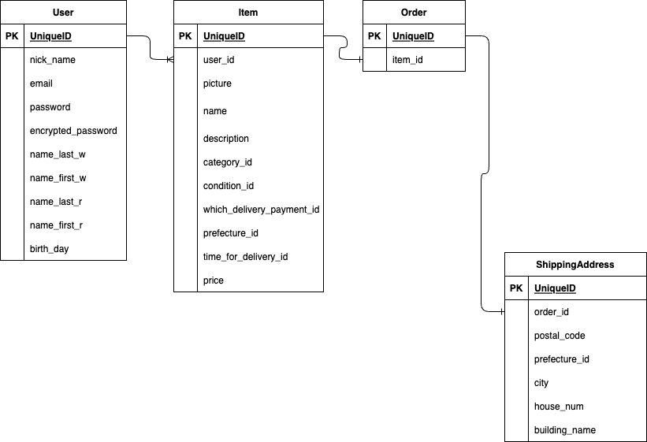

# データベース設計

-----------------------------------------------------------------------
## Users
### when create devise_controller
| Column | Type | Options |
| ---- | ---- | ---- |
| nick_name | string | null: false |
| email | string | null: false  uniqueness include "@" |
| encrypted_password | string | null: false equal password  |
| name_last_w | string | null: false full-width kanji |
| name_first_w | string | null: false full-width kanji |
| name_last_r | string | null: false full-width katakana |
| name_first_r | string | null: false full-width katakana |
| birth_day | Date | null: false full-width greater_than: 1920/1/1  smaller_than: 2100/1/1|

### データベースに保存しない ActiveHash
## Ad
| Column | Type | Options |
| ---- | ---- | ---- |
| year |integer|null: false over 1929 Below 2051|
## Month
| Column | Type | Options |
| ---- | ---- | ---- |
| month | integer |null: false over 1929 Below 2051|
## Day
| Column | Type | Options |
| ---- | ---- | ---- |
| day_int | integer |null: false over 0 Below 32|

-----------------------------------------------------------------------
## Item
| Column | Type | Options |
| ---- | ---- | ---- |
|name|string|null: false  Below 41|
|description|text|null: false  Below 1001|
|category_id| integer |null: false Below 3|
|condition_id| integer |null: false Below 7|
|which_delivery_payment_id|integer|null: false Below 3|
| prefecture_id | integer |null: false Below 48|
| time_for_delivery_id | integer |null: false Below 4|
| price | integer | null: false Over 299 Under 10000000 |
| user | references | null: false  foreign_key:true|

### データベースに保存しない ActiveHash
## Category
| Column | Type | Options |
| ---- | ---- | ---- |
| name | string |null: false|
## Condition
| Column | Type | Options |
| ---- | ---- | ---- |
| description | text | null: false |
## TimeForDelivery
| Column | Type | Options |
| ---- | ---- | ---- |
| description | text | null: false |
## WhichDeliveryPayment 
| Column | Type | Options |
| ---- | ---- | ---- |
| who | string | null: false |
## Prefecture
| Column | Type | Options |
| ---- | ---- | ---- |
| name | string | null:false |

-----------------------------------------------------------------------
## Order
| Column | Type | Options |
| ---- | ---- | ---- |
| user | references |  null:false foreign_key:true|
| item | references |  null:false foreign_key:true|

| Column | Type | Options |
| ---- | ---- | ---- |
| postal_code | string | null:false \d{3}-\d{4} |
| prefecture_id | integer | null: false foreign_key:true Below 48 |
| city | string | null:false |
| house_num | string | null:false |
| building_name | string | null:true |
| order | references | null: false foreign_key:true |

# Association
## User
### when generate items_controller
- has_many :items
### when generate orders_controller
- has_many :orders
----
## Item
### when generate items_controller
- belongs_to :user
- belongs_to :category
- belongs_to :condition
- belongs_to :time_for_delivery
- belongs_to :which_delivery_payment
- belongs_to :prefecture
### when generate order_controller
- has_one:order
- has_one:order
## Category
- has_many :items
## Condition
- has_many :items
## TimeForDelivery
- has_many :items
## WhichDeliveryPayment
- has_many :items
## Prefecture
- has_many :items

----
## Order
- belongs_to:item
- belongs_to:user
- has_one:shipping_address

## ShippingAddress
- belongs_to:order
- belongs_to:prefecture

## Prefectures
- has_many:shipping_addresses

# ER図
